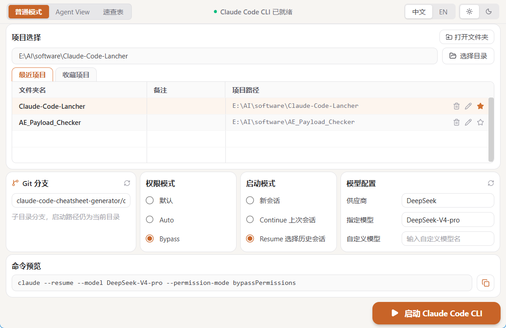
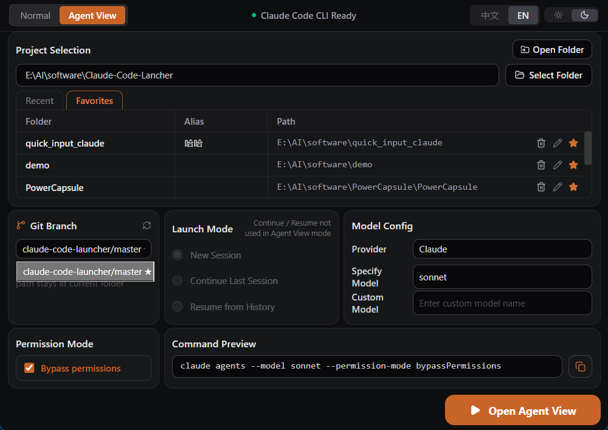

<div align="center">
  
  <h1>Claude Code Launcher</h1>
  <p>Skip the terminal gymnastics. Launch <a href="https://claude.ai/code">Claude Code</a> from a clean GUI — no commands to memorize.</p>

  <p>
    <a href="README.md"><b>English</b></a> · <a href="README.zh-CN.md">中文</a>
  </p>

  <p>
    
    
    
    
    
    
  </p>
</div>

---

## Why This Exists

Using Claude Code normally looks like this:

```
1. Find your project folder in File Explorer
2. Right-click → Open Terminal
3. Type:  claude --continue --model claude-sonnet-4-5 --permission-mode bypassPermissions
4. Realize you forgot --resume to pick a specific conversation
5. Start over.
```

It's tedious for beginners and repetitive for everyone else.

**Claude Code Launcher wraps that entire workflow in a GUI:**

- **Pick your project** from a saved list — no more navigating folders in a terminal
- **Toggle bypass permissions** with a switch — no more memorizing `--permission-mode bypassPermissions`
- **Choose your conversation** visually — New / Continue / Resume, right there as a radio button
- **See the exact command** being built in real time before you hit Launch

If you're an experienced user, think of it as a project manager for your Claude Code sessions — one app to organize all your codebases, switch Git branches, configure models, and launch instantly.

---

## Screenshots

**☀️ Light Mode · Normal**



**🌙 Dark Mode · Agent View**



---

## Features

| | Feature | What it replaces |
|---|---|---|
| 📁 | Project list with favorites & aliases | Navigating to folders manually every time |
| 🌿 | Git branch selector | `git checkout` before launching |
| 💬 | New · Continue · Resume session modes | Memorizing `--continue` / `--resume` flags |
| 🤖 | Agent View mode (`claude agents`) | Typing the agents subcommand |
| 🔓 | Bypass permissions toggle | Typing `--permission-mode bypassPermissions` |
| 🧠 | Auto-detects model from `.claude/settings.json` | Manually specifying `--model` every time |
| 👁 | Live command preview + copy | Guessing what flags were applied |
| 🌐 | Multi-provider support (Claude · DeepSeek · OpenAI · Gemini · Kimi · Qwen) | Hard-coding `--model` per provider |
| 🎨 | Light / Dark theme, zh-CN / English UI | — |

---

## Prerequisites

| Requirement | Notes |
|---|---|
| Windows 10 / 11 | Launches Claude in Windows Terminal or PowerShell |
| [Claude Code CLI](https://claude.ai/code) | Must be installed and callable as `claude` |
| Node.js ≥ 20 + pnpm ≥ 9 | Only needed for building from source |
| Rust (stable) | Only needed for building from source |

---

## Installation

### Download Release (Recommended)

Go to [Releases](https://github.com/YoyoDavidGo/Claude-Code-Cli-launcher/releases) and download the latest `.msi` or `.exe` installer.

### Build from Source

```powershell
git clone https://github.com/YoyoDavidGo/Claude-Code-Cli-launcher.git
cd Claude-Code-Cli-launcher

pnpm install

# Dev mode (hot-reload frontend)
pnpm tauri dev

# Production build → installer in src-tauri/target/release/bundle/
pnpm tauri build
```

---

## Usage

1. **Add a project** — click **Choose Directory** or type the path directly; it's saved for next time
2. **Pick a branch** — the Git panel shows your current branch; switch before launching if needed
3. **Choose session mode**
   - `New Session` — fresh start
   - `Continue` — picks up the last conversation (`--continue`)
   - `Resume` — shows a list of past conversations to choose from (`--resume`)
4. **Configure the model** — auto-detected from `.claude/settings.json`; override anytime
5. **Check the preview** — the bottom bar shows the exact command; click **Copy** or just **Launch**

> Switch to **Agent View** from the top toolbar to open the `claude agents` dashboard instead.

---

## Configuration

Auto-saved to `%APPDATA%\com.claudecodelauncher.app\config.json`.

| Field | Default | Description |
|---|---|---|
| `defaultLaunchMode` | `continue` | Session mode on startup |
| `defaultProvider` | `Claude` | AI provider |
| `defaultModel` | `sonnet` | Model preset |
| `defaultBypass` | `false` | Bypass permissions on/off |
| `defaultLanguage` | `zh-CN` | UI language |
| `defaultTheme` | `light` | UI theme |
| `projects` | `[]` | Saved projects (max 20 recent + unlimited favorites) |

---

## Tech Stack

| Layer | Technology |
|---|---|
| Desktop shell | Tauri v2 (Rust) |
| UI framework | React 19 + TypeScript |
| Styling | Tailwind CSS v4 |
| State | Zustand v5 |
| Build tool | Vite 7 + pnpm |

---

## Contributing

PRs are welcome. For major changes, open an issue first.

```powershell
pnpm tsc --noEmit   # type-check before submitting
```

---

## License

[MIT](LICENSE) © 2026 David (YoyoDavidGo)
