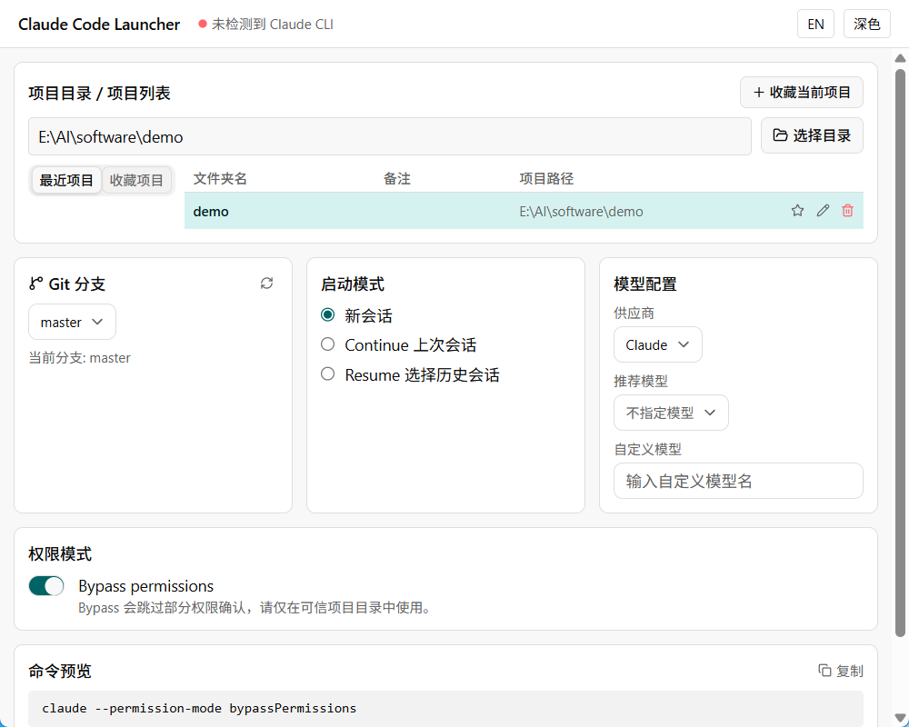

<div align="center">
  
  <h1>Claude Code Launcher</h1>
  <p>告别繁琐的终端操作，用一个干净的图形界面启动 <a href="https://claude.ai/code">Claude Code</a>，无需记忆任何命令。</p>

  <p>
    <a href="README.md">English</a> · <a href="README.zh-CN.md"><b>中文</b></a>
  </p>

  <p>
    
    
    
    
    
    
  </p>
</div>

---

## 为什么要做这个软件

没有它之前，你使用 Claude Code 的流程是这样的：

```
1. 在文件资源管理器里找到你的项目文件夹
2. 右键 → 在终端中打开
3. 输入：claude --continue --model claude-sonnet-4-5 --permission-mode bypassPermissions
4. 发现忘了加 --resume 来选择某次历史对话
5. 重来一遍。
```

对新手来说繁琐，对老手来说也是重复劳动。

**Claude Code Launcher 把这套流程包进了一个图形界面：**

- **从收藏列表选项目** — 不用每次在终端里翻文件夹
- **一个开关搞定绕过权限** — 不用记忆 `--permission-mode bypassPermissions` 这串命令
- **可视化选择对话** — 新会话 / Continue / Resume，直接点选，无需记参数
- **实时预览完整命令** — 点击启动前就能看到实际执行的是什么

如果你是有经验的用户，可以把它理解成 Claude Code 的项目管理器 —— 一个应用统一管理所有代码仓库，切换 Git 分支、配置模型、一键启动。

---

## 界面截图

<div align="center">
  
</div>

---

## 功能一览

| | 功能 | 替代了什么 |
|---|---|---|
| 📁 | 项目列表，支持收藏与备注别名 | 每次手动找文件夹 |
| 🌿 | Git 分支选择器 | 启动前手动 `git checkout` |
| 💬 | 新会话 · Continue · Resume 三种模式 | 记忆 `--continue` / `--resume` 参数 |
| 🤖 | Agent View 模式（`claude agents`） | 手动输入 agents 子命令 |
| 🔓 | 绕过权限一键开关 | 输入 `--permission-mode bypassPermissions` |
| 🧠 | 自动从 `.claude/settings.json` 检测模型 | 每次手动指定 `--model` |
| 👁 | 实时命令预览 + 一键复制 | 猜测当前生效了哪些参数 |
| 🌐 | 多服务商支持（Claude · DeepSeek · OpenAI · Gemini · Kimi · Qwen） | 为每个服务商单独记 `--model` 参数 |
| 🎨 | 亮色 / 暗色主题，中文 / English 界面 | — |

---

## 环境要求

| 依赖 | 说明 |
|---|---|
| Windows 10 / 11 | 通过 Windows Terminal 或 PowerShell 启动 Claude |
| [Claude Code CLI](https://claude.ai/code) | 需已安装，可在终端直接运行 `claude` |
| Node.js ≥ 20 + pnpm ≥ 9 | 仅从源码构建时需要 |
| Rust (stable) | 仅从源码构建时需要 |

---

## 安装方式

### 下载安装包（推荐）

前往 [Releases](https://github.com/YoyoDavidGo/Claude-Code-Cli-launcher/releases) 下载最新的 `.msi` 或 `.exe` 安装包。

### 从源码构建

```powershell
git clone https://github.com/YoyoDavidGo/Claude-Code-Cli-launcher.git
cd Claude-Code-Cli-launcher

pnpm install

# 开发模式（前端热更新）
pnpm tauri dev

# 生产构建 → 安装包输出至 src-tauri/target/release/bundle/
pnpm tauri build
```

---

## 使用方法

1. **添加项目** — 点击 **选择目录** 或直接输入路径，下次自动出现在列表中
2. **选择分支** — Git 分支面板显示当前分支，启动前可直接切换
3. **选择会话模式**
   - `新会话` — 全新开始
   - `Continue` — 续接上次会话（`--continue`）
   - `Resume` — 从历史会话列表中选择一次恢复（`--resume`）
4. **配置模型** — 自动从 `.claude/settings.json` 读取，也可随时手动覆盖
5. **预览并启动** — 底部实时显示完整命令，点击 **复制** 或直接点 **启动**

> 点击顶部工具栏的模式切换，可进入 **Agent View** 模式，直接打开 `claude agents` 面板。

---

## 配置文件

自动保存至 `%APPDATA%\com.claudecodelauncher.app\config.json`。

| 字段 | 默认值 | 说明 |
|---|---|---|
| `defaultLaunchMode` | `continue` | 启动时的默认会话模式 |
| `defaultProvider` | `Claude` | 默认 AI 服务商 |
| `defaultModel` | `sonnet` | 默认模型预设 |
| `defaultBypass` | `false` | 是否默认开启绕过权限 |
| `defaultLanguage` | `zh-CN` | 界面语言 |
| `defaultTheme` | `light` | 界面主题 |
| `projects` | `[]` | 保存的项目列表（最多 20 个最近 + 无限收藏） |

---

## 技术栈

| 层级 | 技术 |
|---|---|
| 桌面壳 | Tauri v2 (Rust) |
| UI 框架 | React 19 + TypeScript |
| 样式 | Tailwind CSS v4 |
| 状态管理 | Zustand v5 |
| 构建工具 | Vite 7 + pnpm |

---

## 参与贡献

欢迎提交 Pull Request，重大改动请先开 Issue 讨论。

```powershell
pnpm tsc --noEmit   # 提交前先过类型检查
```

---

## 许可证

[MIT](LICENSE) © 2026 David (YoyoDavidGo)
